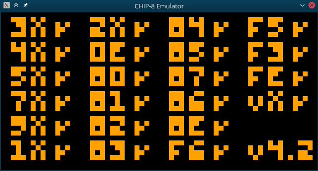
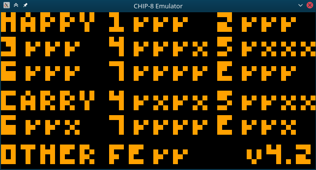

# About
ZIPPY-8 is an emulator for the CHIP-8 written in Zig, using the Raylib library for visuals.


# Usage
As of right now, the implementation necessitates building from source.

Clone the source into a directory of your choosing. 

```git clone https://github.com/Denkkou/ZIPPY-8```

Modify this line in `main.zig` to point to your desired ROM, relative to the directory of `main.zig`:

```try cpu.loadRom("roms/*.ch8");```

In your text editor or command line run:

```zig build run```

This project depends on raylib-zig (https://github.com/raylib-zig/raylib-zig)

## Input
The original CHIP-8 used a Hex keypad for input. I have mapped the first four
columns of the QWERTY layout to match.
```
Hex          QWERTY
1 2 3 C  ->  1 2 3 4
4 5 6 D      Q W E R
7 8 9 E      A S D F
A 0 B F      Z X C V
```

# What I Learned
This emulator was my first larger scale personal project, in a language I was unfamiliar with. I wanted
to give something like this a go as I've always been interested in low level programming, and Zig
looked really fun to learn.

- Learned how emulation works, what considerations need to be made for accuracy, and how it scales up to more complex systems.
- I learned how to navigate Zig's build system and import an external library (Raylib-zig).
- Memory management in Zig; passing allocators, using the defer keyword and staying attentive to types and their size.
- Bitshifting and bitwise operations, as well as generally handling hex and binary values.
- Deconstructing a project like this into its components - Input, file reading, display, processing.
- Reading technical specifications and documentation on both the CHIP-8 and Zig.
- How CPUs function at a deeper level, and how machine code / assembly interacts with the system.


# Known Issues
- Currently passes the Corax+ test from Timendus' testing suite, but...
- Fails a few flag tests especially with opcodes 8XY4 and 8XY5.
- Some games run fine, like Pong and Space Invaders, but others like Tetris and Breakout don't work properly.
- Currently the random value opcode CXNN is unimplemented, which may cause the above.
- When running Timendus' quirks test, behaviour doesn't 100% match original CHIP-8 quirks (not necessarily a bad thing, but less faithful to the original system).


# Future Features:
- Allow running from command line with passed filepath argument.
- Implement missing opcode.
- Investigate the opcodes responsible for math operations and why they have semi-inconsistent behaviour when carrying.
- Iron out the quirks by studying the differences between CHIP-8 variations.
- Possibly find a better solution than a large switch tree for decoding opcodes.


# Screenshots of the Testing Suite
#### Opcodes:

All opcodes pass function tests in the 'happy path'.

#### Flags:

HAPPY is for operations where a carry is not expected. Visa versa for CARRY. OTHER specifically checks FX1E.
- First flag: Correct output value
- Second flag: The carry flag in VF is correct
- Third flag: If VF can be used as VY input
- Fourth flag: If VF can be used as VX input

#### Quirks:

Results when selecting the original CHIP-8. These quirks differ between variations and can be used to determine how faithful an implementation is to the intended system.


# Resources
[Cowgod's CHIP-8 Technical Reference](http://devernay.free.fr/hacks/chip8/C8TECH10.HTM)

[Timendus' CHIP-8 Testing Suite](https://github.com/Timendus/chip8-test-suite?tab=readme-ov-file)

[IridescentRose's implementation of a CHIP-8 emulator in Zig](https://github.com/IridescentRose/CHIP-8z)

[Austin Morlan's implementation of a CHIP-8 emulator in C](https://austinmorlan.com/posts/chip8_emulator/)

[The Zig language reference](https://ziglang.org/documentation/master/#Introduction)
